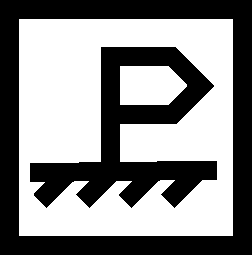

# Puheg HAL driver

Это чтото вроде драйвера для работы с пухег-станцией. Пока работа в самом начале. Программа призвана быть прокладкой между MAC-уровнем и сетью TCP/IP.

В настоящее время идет работа над базовой механикой - связь со станцией через вебсокет, разбор/генерация пакетов верхнего уровня Puheg Stack.
